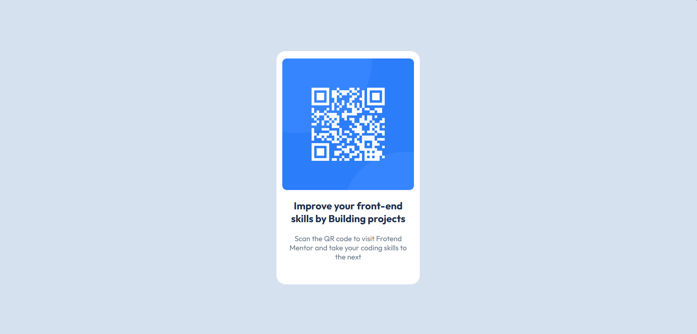

# Frontend Mentor | QR code
O desafio do componente QR Code do Frontend Mentor consiste em criar uma representação visual de um código QR e a mensagem associada a ele em uma página da web. O objetivo é desenvolver um componente responsivo e visualmente atraente, utilizando HTML e CSS.

## O que eu aprendi
Durante o desenvolvimento deste projeto, aprendi a importância do uso de HTML semântico para melhorar a acessibilidade. Também refinei minhas habilidades em CSS, especialmente no uso de Flexbox para criar layouts responsivos.

## Construído com:

- Marcação HTML5 semântica
- Propriedades CSS customizadas
- Flexbox

 
